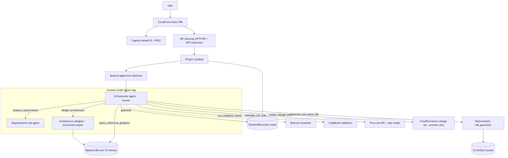

# CloudCompass Builder

A governed, **model-driven** multi-agent AWS infrastructure generator. It accepts
a natural-language infrastructure prompt and produces a validated, cost-estimated,
deployable Python CDK project plus a CloudFormation **change-set preview**. The MVP
stops at `CHANGE_SET_READY` — it never executes the change set.

> **Status: deployed and demoed end-to-end** (us-east-1). A Bedrock Sonnet-class
> orchestrator reasons about the prompt, retrieves approved guidance from a Bedrock
> Knowledge Base, designs a schema-validated architecture, generates a CDK project,
> validates it, estimates cost, and creates a change set. See `docs/report.pdf`.

## What's implemented

- **Model-driven multi-agent orchestration** (Strands on Bedrock AgentCore): a
  Sonnet-class orchestrator drives the workflow via tools and delegates to a
  requirements sub-agent and a structured-output architecture designer. No
  deterministic fallback — the model genuinely runs.
- **Real RAG**: a Bedrock Knowledge Base over **S3 Vectors** (Titan embeddings),
  seeded from `knowledge_corpus/`, with a curated fallback.
- **Deterministic CDK generator** (`cdk_generator/`) for 6 service types:
  `s3_bucket`, `cloudfront_site`, `cognito_user_pool`, `lambda_api`,
  `dynamodb_table`, `ses_email` — snapshot/synth-tested.
- **Governed deployment**: CodeBuild validation + a CloudFormation change set the
  agent can create/describe but **not execute**.
- **Computed per-run cost** from the AWS Price List API (tokens + build minutes).
- **Bedrock Guardrail** (prompt-injection + content filters) on every model call.
- **Auth + UI**: Cognito Hosted UI (PKCE), CloudFront + private S3 SPA, API
  Gateway HTTP API with a Cognito JWT authorizer.
- **Observability**: CloudWatch logs/dashboard, X-Ray, AgentCore platform telemetry.
- **Least-privilege IAM**, asserted by a test across all 8 stacks (no bare `*` actions).

## Architecture

8 account-agnostic CDK stacks (`cdk_app/`): `Storage`, `FrontendHosting`, `Auth`,
`Validation`, `Knowledge`, `Agent`, `Api`, `FrontendDeployment`. Full diagram and
workflow in [`docs/architecture.md`](docs/architecture.md) and the report.



## Repository layout

```text
.
├── app.py                # CDK app entry point (8 stacks)
├── cdk_app/              # CloudCompass platform CDK stacks
├── agent/                # Strands model-driven app (deployed to AgentCore)
├── cdk_generator/        # Deterministic generated-project renderer (the product)
├── knowledge_corpus/     # RAG guidance docs (ingested into the Knowledge Base)
├── frontend/             # Static authenticated SPA
├── lambdas/              # API Lambda handlers (projects, agent_invoker, upload_url)
├── docs/                 # report.md/pdf, architecture.md/png
└── tests/                # CDK, generator, Lambda, tool tests
```

## Quickstart

Prerequisites: **Python 3.12+**, **Node 20/22/24** (not 26) + the CDK CLI
(`npm i -g aws-cdk`), **Docker** running (for the agent image), and AWS
credentials configured.

```bash
python3 -m venv .venv
source .venv/bin/activate            # Windows: .venv\Scripts\activate
pip install -r requirements.txt -r requirements-dev.txt -r cdk_generator/requirements.txt

pytest                               # 34 passed / 2 skipped
cdk synth                            # synthesizes all 8 stacks

# To also run the generated-project cdk synth checks:
RUN_SLOW_CDK_TESTS=1 pytest tests/generator/test_synth_validity.py
```

## Deploy

```bash
cdk bootstrap                        # once per account/region
cdk deploy --all --require-approval never
```

**Account prerequisites (one-time):**

1. **Bedrock model access** — in the Bedrock console (deploy region), enable the
   Anthropic Claude models and submit the **use-case details form** (account-wide,
   ~15 min to propagate). Without it, the agent gets a model-access error at runtime.
2. **KB ingestion** — after deploy, start one ingestion job so RAG returns matches:
   ```bash
   aws bedrock-agent start-ingestion-job \
     --knowledge-base-id <KnowledgeBaseId> --data-source-id <DataSourceId> --region <region>
   ```
   (Until then, `query_reference_guidance` uses its curated fallback.)

**Tear down** when finished (the stacks bill while running):

```bash
cdk destroy --all
```

## Demo

Prompt:

```text
Create the AWS infrastructure for a small online bakery. I need a static website,
customer login, an order API, a database for orders, email receipts, logs, and a
monthly budget under $200.
```

Sign in via the deployed CloudFront URL and submit it, or invoke the runtime
directly:

```python
import boto3, json, uuid
from botocore.config import Config
c = boto3.client("bedrock-agentcore", region_name="us-east-1",
                 config=Config(read_timeout=600))  # the full agentic run takes ~1-2 min
r = c.invoke_agent_runtime(
    agentRuntimeArn="<AgentRuntimeArn>",
    runtimeSessionId="demo-" + uuid.uuid4().hex + uuid.uuid4().hex,   # >= 33 chars
    payload=json.dumps({"user_id": "demo", "project_id": str(uuid.uuid4()),
                        "prompt": "<prompt>", "region": "us-east-1"}).encode())
print(r["response"].read().decode())
```

Result: requirements + architecture summary, generated CDK zip in S3, validation
summary, computed cost (~$0.05/run), a CloudFormation change-set ARN, and final
status `CHANGE_SET_READY`.
