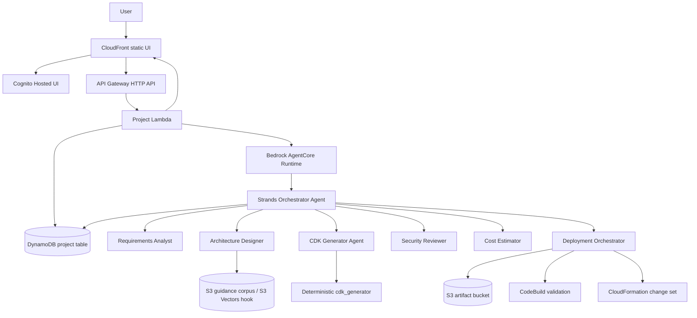

# CloudCompass Builder Architecture

CloudCompass Builder is a governed multi-agent AWS infrastructure generator. A
user submits a natural-language request, and the system produces a validated
Python CDK project, stores the artifact, estimates the generation cost, and
creates a CloudFormation change-set preview. The MVP never executes the change
set automatically.

## Components

| Layer | Service | Purpose |
|---|---|---|
| Frontend | S3 private bucket + CloudFront OAC | Static authenticated UI |
| Auth | Amazon Cognito | Hosted UI sign-in and JWTs |
| API | API Gateway HTTP API | Authenticated `/projects` routes |
| Entry compute | AWS Lambda | Validates requests, derives user identity, invokes AgentCore |
| Agent runtime | Amazon Bedrock AgentCore Runtime | Hosts the Strands multi-agent app |
| Agent tools | Strands `@tool` functions | S3 artifacts, DynamoDB state, pricing, validation, change set |
| Generation | `cdk_generator` package | Deterministic Python CDK renderer |
| Data | DynamoDB | Project status and metadata, keyed by user/project |
| Artifacts | S3 | Generated CDK zip, manifest, preview template |
| Validation | CodeBuild | Installs dependencies, compiles generated Python, runs `cdk synth` |
| Preview | CloudFormation | Creates a change set for human review only |
| Observability | CloudWatch + X-Ray | Lambda, CodeBuild, and AgentCore visibility |

## Workflow

## API Flow

1. The browser signs in with Cognito and stores the returned ID token.
2. The browser calls `POST /projects` with `{ "prompt": "...", "region": "us-east-1" }`.
3. API Gateway validates the Cognito JWT and invokes the project Lambda.
4. The Lambda derives `user_id` from the JWT `sub`, creates the project record, and invokes AgentCore.
5. The Strands app moves through `DESIGNING`, `GENERATING_CDK`, `VALIDATING`, and `CHANGE_SET_READY`.
6. Generated CDK files are zipped and written to S3.
7. CodeBuild validation is started with the artifact S3 URI.
8. A CloudFormation change set is created for preview only.
9. The UI reads `GET /projects/{project_id}` and displays the summary, artifact link, validation result, cost estimate, and change-set ARN.

## MVP Boundaries

- Final state is `CHANGE_SET_READY`.
- The agent role can create and describe change sets, but it cannot execute them.
- The deterministic generator supports the canonical MVP templates: S3, Lambda/API Gateway, and DynamoDB.
- CloudFront, Cognito, SES, and full bakery runtime services are documented in the architecture and represented in the CloudCompass platform; expanding the generated CDK catalog is future work.
- S3 Vectors and AgentCore Gateway are integrated as pluggable hooks where AWS APIs are available; the MVP includes a curated fallback guidance corpus so the demo remains deployable.
