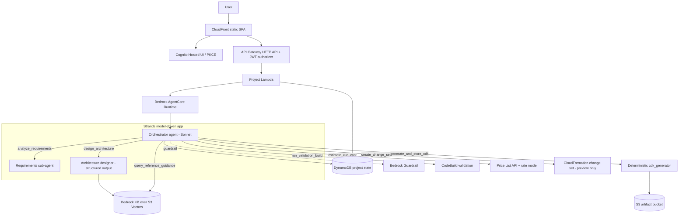

# CloudCompass Builder — Architecture

CloudCompass Builder is a governed, model-driven AWS infrastructure generator. A
user submits a natural-language request; a Bedrock model (via Strands on
AgentCore) reasons about it, retrieves approved guidance (RAG), designs a
validated architecture spec, renders a Python CDK project with a deterministic
generator, validates it, estimates the cost, and creates a CloudFormation
change-set preview. The MVP never executes the change set.

## Components

| Layer | Service | Purpose |
|---|---|---|
| Frontend | S3 private bucket + CloudFront OAC | Static authenticated SPA |
| Auth | Amazon Cognito (Hosted UI, PKCE) | Sign-in and JWTs |
| API | API Gateway HTTP API + JWT authorizer | Authenticated `/projects` routes |
| Entry compute | AWS Lambda (ARM64) | Validates requests, derives identity, invokes AgentCore |
| Agent runtime | Bedrock AgentCore Runtime | Hosts the Strands model-driven app |
| Model | Bedrock Claude Sonnet-class inference profile (+ Haiku) | Reasoning: requirements, architecture design, orchestration |
| Safety | Bedrock Guardrail | Prompt-injection + content filters on every model call |
| Knowledge / RAG | Bedrock Knowledge Base over S3 Vectors | Retrieval of approved architecture guidance |
| Generation | `cdk_generator` package | Deterministic Python-CDK renderer (6-service catalog) |
| State | DynamoDB single table | Project status + metadata, keyed by user/project |
| Artifacts | S3 | Generated CDK zip, manifest, preview template |
| Validation | CodeBuild | `pip install` + `compileall` + `cdk synth` of the generated project |
| Preview | CloudFormation | Change set for human review only |
| Observability | CloudWatch + X-Ray + dashboard | Lambda, CodeBuild, AgentCore visibility |

## Workflow

## API Flow

1. The browser signs in with Cognito (auth-code + PKCE) and stores the ID token.
2. `POST /projects { prompt, region }`; API Gateway validates the JWT.
3. The project Lambda derives `user_id` from the JWT `sub`, writes `RECEIVED`, invokes AgentCore.
4. The orchestrator drives `DESIGNING → VALIDATING → CHANGE_SET_READY`, calling sub-agents and tools (each tool persists its result).
5. The generated CDK files are zipped to S3; CodeBuild validation is started; a CloudFormation change set is created for preview.
6. The UI reads `GET /projects/{project_id}` and shows the summary, artifact link, validation result, cost, and change-set ARN.

## MVP Boundaries

- Final state is `CHANGE_SET_READY`; the agent role can create/describe change sets but **cannot execute** them.
- The generated-service catalog: `s3_bucket`, `cloudfront_site`, `cognito_user_pool`, `lambda_api`, `dynamodb_table`, `ses_email`.
- RAG is a real Bedrock Knowledge Base over S3 Vectors; a curated fallback covers the window before the first ingestion job.
- AgentCore Gateway is intentionally out of scope — the agent uses in-process Strands `@tools`.
- Single region; AgentCore PUBLIC network mode.

> Export this diagram to `architecture.png` for the PDF (e.g. paste the Mermaid block
> into mermaid.live → Export PNG, or `mmdc -i architecture.md -o architecture.png`).
